# Phase 3: Aging Clock Model Building

## Model Visualizations

> [!NOTE] Model Performance Overview
> These visualizations summarize the aging clock model's performance and key features. The model predicts chronological age from cfDNA methylation patterns with a mean absolute error of 7.08 years.

### Predicted vs Actual Age

![[3a_predicted_vs_actual.png|600]]

**Strong correlation (r=0.909)** between predicted and actual ages. Points colored by age acceleration show most predictions cluster around the perfect prediction line (dashed diagonal). The tight clustering indicates good model performance with minimal systematic bias.

---

### Residual Analysis

![[3a_residuals.png|600]]

**Left panel**: Residuals vs Actual Age - Shows prediction errors across different age groups. **Right panel**: Residuals vs Predicted Age - Identifies systematic biases in predictions. The red horizontal line at y=0 represents perfect predictions. The even distribution of points around this line suggests the model has no major systematic bias. The vertical colorbar on the right indicates age acceleration values.

---

### Feature Importance

![[3a_coefficients.png|600]]

**LASSO-selected CpG sites** (50 total) ranked by absolute coefficient magnitude. Bars are colored by chromosome. **Red edges** indicate positive correlation with age (higher methylation = older predicted age). **Blue edges** indicate negative correlation. The top predictor is chr10:111078376 with the strongest positive effect (+3.62 years per unit methylation increase).

---

### Age Acceleration Distribution

![[3a_age_acceleration.png|600]]

**Distribution of age acceleration** (predicted age - actual age) across all 104 samples. The green vertical line shows the mean acceleration (-0.02 years, nearly zero). The red line at zero represents no acceleration. The distribution ranges from -15 to +15 years, indicating some individuals appear biologically younger or older than their chronological age. This metric can be used to study accelerated or decelerated aging.

## 0. Purpose and Summary of the Script

This script builds the aging clock model using the selected CpG sites from Phase 2. It trains a LASSO regression model that predicts chronological age from methylation patterns, using nested cross-validation to ensure robust performance estimates given our small sample size.

**Goal**: Train a model that predicts age from methylation patterns.

### What We Do:

1. **Prepare the Data**
   - Use the 86 CpG sites we selected in Phase 2
   - Create a feature matrix (samples × CpG sites)
   - Standardize the data (zero mean, unit variance)

2. **Smart Cross-Validation**
   - Since we only have 105 samples, we use a special approach:
     - **Outer loop**: Leave-one-sample-out (test on 1, train on 104) - repeated 105 times
     - **Inner loop**: For each training set, use 5-fold CV to find the best settings
   - This gives us honest performance estimates without wasting data

3. **Build LASSO Model**
   - LASSO = Linear regression that automatically selects the most important CpG sites
   - It shrinks unimportant coefficients to zero, keeping only the best predictors
   - Formula: Age = (CpG₁ × weight₁) + (CpG₂ × weight₂) + ... + constant

4. **Find Optimal Settings**
   - Test different "regularization strengths" (how many CpG sites to keep)
   - Choose the simplest model that's still 95% as good as the best one
   - This prevents overfitting

5. **Train Final Model**
   - Train on all 105 samples with the optimal settings
   - Extract the final set of CpG sites and their weights
   - Save the trained model for making predictions

**Result**: A sparse, interpretable aging clock that uses only the most important CpG sites to predict age.

## 1. Input

- `result/2_selected_features.csv`: Age-associated CpG sites selected in Phase 2
- `result/1_preprocessed_data.csv`: Preprocessed methylation data with age information

## 2. Output

- `result/3_cv_predictions.csv`: Cross-validation predictions for each sample (sample ID, actual age, predicted age, age acceleration)
- `result/3_cv_metrics.csv`: Cross-validation performance metrics (MAE, RMSE, R², correlation, sample count, feature count)
- `result/3_model_coefficients.csv`: Final model coefficients for selected CpG sites (sorted by absolute value)
- `result/3_model_intercept.csv`: Model intercept term
- `result/3_trained_model.pkl`: Complete trained model package (LASSO model, StandardScaler, and CpG site list)

## 3. Method used

- **LASSO (Least Absolute Shrinkage and Selection Operator) regression** with L1 regularization
- **Nested cross-validation strategy**:
  - Outer loop: Leave-One-Out Cross-Validation (LOOCV, 104 folds)
  - Inner loop: 5-fold CV for hyperparameter tuning
- **1-SE rule**: Selects the sparsest model within 95% of the best cross-validation performance
- **Feature standardization**: Zero mean and unit variance scaling before model training
- **Missing value handling**: Median imputation (3 missing values found and imputed)
- **Hyperparameter grid**: 50 alpha values from 10^-4 to 10^1 (logarithmic scale)

Sample code:
```python
# LASSO with cross-validation
lasso_cv = LassoCV(alphas=alphas, cv=5, max_iter=50000, tol=1e-3)
lasso_cv.fit(X_train_scaled, y_train)

# Apply 1-SE rule for sparser model
min_mse_idx = np.argmin(mse_path)
se_threshold = min_mse + std_mse_path[min_mse_idx] / np.sqrt(5)
candidates = np.where(mse_path <= se_threshold)[0]
selected_alpha = lasso_cv.alphas_[candidates[-1]]  # Largest alpha = sparsest model
```

## 4. Summary of the results

- **Cross-validation performance**: MAE = 7.08 years, RMSE = 8.78 years, R² = 0.823, Correlation = 0.909
- **Final model**: Selected 50 CpG sites out of the 86 candidate sites from Phase 2 (42% reduction)
- **Top predictive CpG sites** (by absolute coefficient magnitude):
  - chr10:111078376-111078905 (coefficient: +3.62)
  - chr3:169665319-169667619 (coefficient: -2.95)
  - chr12:21773354-21774256 (coefficient: -2.54)
  - chr19:58203883-58204874 (coefficient: +2.50)
  - chr8:10652508-10655054 (coefficient: -2.20)
- **Model characteristics**: Sparse, interpretable model with nested CV providing unbiased performance estimates
- **Data usage**: Maximizes data utilization with LOOCV while maintaining honest evaluation through nested CV structure

> [!INFO] Understanding MAE and RMSE
> **MAE (Mean Absolute Error) = 7.08 years**: On average, our model's age predictions are off by about 7 years. This means if we predict someone is 50 years old, they're likely between 43-57 years old in reality. MAE treats all errors equally.
> 
> **RMSE (Root Mean Squared Error) = 8.78 years**: This penalizes large errors more heavily than MAE. The higher value compared to MAE suggests we have some predictions that are quite far off. Both metrics indicate our model meets the <10 year target.

> [!TIP] Interpreting Coefficient Magnitude
> **Absolute coefficient values** represent the importance of each CpG site in predicting age. A coefficient of +3.62 means that a 1-unit increase in methylation at that site (after standardization) increases the predicted age by 3.62 years, holding all other sites constant. 
> 
> Larger absolute values = more important predictors. Positive coefficients = higher methylation associated with older age. Negative coefficients = higher methylation associated with younger age.

## 5. Worries/Suspicious places

- **Convergence warnings**: Some cross-validation folds showed convergence warnings (increased max_iter to 50000 and added tol=1e-3 to mitigate)
- **Small sample size**: 104 samples is still relatively small despite regularization; risk of overfitting remains
- **LOOCV computational cost**: Computationally intensive but necessary given limited data
- **Model sparsity**: The 1-SE rule selected a sparse model (49 features); should verify this doesn't underfit
- **Missing values**: 3 missing values were imputed with median; should verify this is appropriate
- **Age distribution**: Need to check if age distribution in LOOCV training/test splits is balanced
- **Feature correlation**: LASSO may arbitrarily select among correlated features; coefficient stability should be assessed in Phase 4
- **Performance target**: MAE of 7.08 years meets the <10 years target, but should be validated on independent data if possible

## Appendix: LASSO Regression and Nested Cross-Validation

### Why LASSO?

LASSO (Least Absolute Shrinkage and Selection Operator) regression uses L1 regularization, which has the unique property of driving some coefficients to exactly zero. This creates a sparse model that:

1. **Performs feature selection** automatically
2. **Prevents overfitting** by penalizing large coefficients
3. **Improves interpretability** by keeping only the most important predictors
4. **Handles high-dimensional data** (p > n situations)

The LASSO objective function minimizes:
```
(1 / (2 * n_samples)) * ||y - Xw||²_2 + α * ||w||_1
```

Where α controls the strength of regularization (larger α = more sparse model).

### Why Nested Cross-Validation?

Given our small sample size (n=104), we need to:

1. **Maximize training data**: Use as much data as possible for training
2. **Avoid data leakage**: Prevent information from test set influencing model selection
3. **Get unbiased estimates**: Properly estimate generalization performance

> [!INFO] Outer Loop: Leave-One-Out Cross-Validation (LOOCV)
> **What it is**: Tests generalization by leaving out one sample at a time (104 folds total)
> 
> **Why we use it**: 
> - Maximizes training data for each fold (103 samples for training)
> - Provides nearly unbiased performance estimates
> - Every sample gets to be the test set exactly once
> 
> **Trade-offs**:
> - Computationally expensive (104 models trained)
> - High variance in performance estimates
> - Models are highly correlated (each trained on 103/104 overlapping samples)

> [!INFO] Inner Loop: 5-fold Cross-Validation
> **What it is**: Within each LOOCV training set, we split the 103 samples into 5 folds for hyperparameter tuning
> 
> **Why we use it**:
> - Selects optimal hyperparameters (alpha) within each training set
> - Prevents overfitting to the validation set
> - More stable than LOOCV for hyperparameter selection
> - Faster than inner LOOCV while still robust
> 
> **Process**:
> - For each candidate alpha value, train on 4 folds, test on 1 fold
> - Rotate through all 5 folds and average performance
> - Select alpha with best average performance

> [!TIP] The 1-SE Rule (One Standard Error Rule)
> **What it is**: Instead of selecting the absolute best performing model, we select the simplest model that's within one standard error of the best performance
> 
> **Why we use it**:
> - **Reduces overfitting**: Prefers sparser models with fewer CpG sites
> - **More robust**: The "best" model might be best by chance; the 1-SE model is more likely to generalize
> - **Increases interpretability**: Simpler models are easier to understand and validate biologically
> 
> **Example**: If the best model has MAE = 7.0 ± 0.5 years, we select the sparsest model with MAE ≤ 7.5 years
> 
> **Result**: Our model selected 50 CpG sites instead of potentially 60+ sites, trading a tiny bit of performance for much better interpretability

### Comparison to Other Approaches

**LASSO vs. Ridge Regression**:
- LASSO performs feature selection (sparse coefficients)
- Ridge keeps all features but shrinks coefficients
- LASSO is better when we expect only a subset of features to be relevant

**LASSO vs. Elastic Net**:
- Elastic Net combines L1 and L2 penalties
- Better for highly correlated features
- LASSO is simpler and sufficient for our initial model

**Nested CV vs. Simple CV**:
- Nested CV provides unbiased performance estimates
- Simple CV can be overly optimistic (data leakage)
- Nested CV is essential for small sample sizes

The approach chosen balances model performance with interpretability and computational feasibility while providing honest performance estimates.

## Script Flow Diagram

```mermaid
flowchart TD
    A[Load Data<br/>2_selected_features.csv<br/>1_preprocessed_data.csv] --> B[Extract Feature Matrix X & Target Vector y]
    B --> C[Handle Missing Values<br/>Median Imputation]
    C --> D[Start Nested Cross-Validation]
    
    D --> E[Outer Loop: Leave-One-Out CV<br/>104 Folds]
    E --> F[Split: 103 Train / 1 Test]
    F --> G[Standardize Training Data]
    G --> H[Inner Loop: 5-fold CV on Training Set]
    
    H --> I[Test Multiple Alpha Values<br/>10^-4 to 10^1]
    I --> J[Find Best Alpha via CV]
    J --> K[Apply 1-SE Rule<br/>Select Sparser Model]
    K --> L[Retrain LASSO with Selected Alpha]
    L --> M[Predict Held-Out Sample]
    M --> N[Store Prediction & Coefficients]
    
    N --> O{More Folds?}
    O -->|Yes| E
    O -->|No| P[Calculate Performance Metrics<br/>MAE, RMSE, R², Correlation]
    
    P --> Q[Save CV Predictions & Metrics]
    Q --> R[Train Final Model on ALL Data]
    
    R --> S[Standardize All Features]
    S --> T[5-fold CV for Hyperparameter Selection]
    T --> U[Apply 1-SE Rule]
    U --> V[Train Final LASSO Model]
    V --> W[Extract Non-Zero Coefficients<br/>49 CpG Sites Selected]
    
    W --> X[Save Model Components<br/>coefficients.csv<br/>intercept.csv<br/>trained_model.pkl]
    
    style A fill:#e1f5ff
    style D fill:#fff2e1
    style E fill:#e8f5e9
    style H fill:#f3e5f5
    style P fill:#ffebee
    style R fill:#e0f2f1
    style W fill:#fce4ec
```


